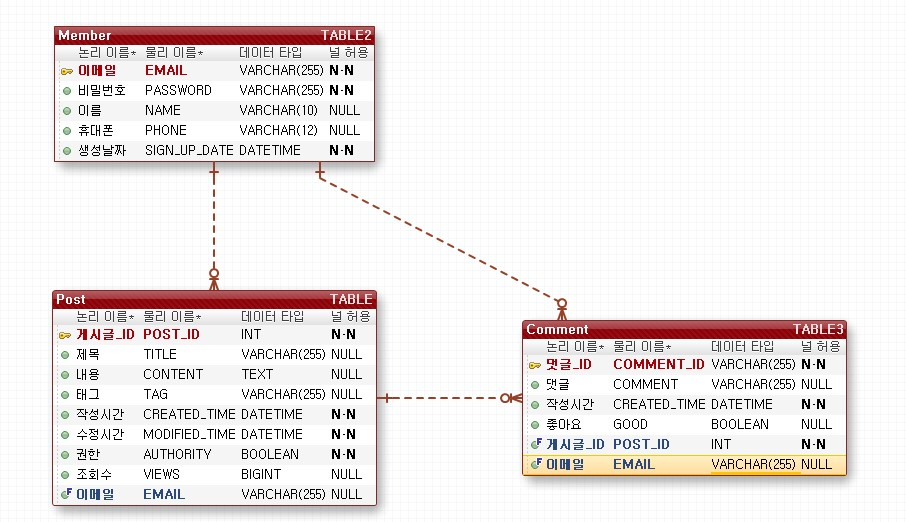

# 🗒 주제 3 게시판 만들기

## 프로젝트 기능 및 설계
- 게시글 작성
  - 작성(제목/내용/태그)을 작성하고 저장한다.
  - 로그인된 사용자만 글을 작성할 수 있다.
 
- 게시글 목록조회 
  - 목록 조회는 조회수, 작성시간(최신순/오래된순), 초성(오름차순/내림차순)으로 조회한다.
  - 비로그인 사용자도 조회 가능하다.
  - 최신순으로 기본정렬된다.
  - 게시글이 많은 경우 페이징처리 한다.

- 게시글 편집
  - 편집은 게시판 작성과 구성은 같고, 권한에 따라서 가능 유무를 정한다.
  - 편집 권한은 로그인상태에서 본인이 작성한 글만 편입가능하다.
  - 로그인 상태에서 본인이 작성한 글은 삭제도 가능하다.

- 게시글 삭제
  - 게시글 작성자는 본인이 작성에 게시글에 한하여 게시글을 삭제 할 수 있다.
    
- 게시물 검색
  - 제목, 내용, 태그에 따라 검색한다.
  - 비로그인 사용자도 검색 가능하다.

- 회원가입 및 관리
  - 이메일, 패스워드, 이름, 번호(휴대폰)를 입력받아 회원가입한다.
  - 아이디는 이메일 아이디를 이용한다.
  - 이름과 휴대폰 번호를 입력하여 아이디(이메일)을 찾을 수 있다.
  - 아이디(이메일), 이름과 휴대폰번호를 입력하여 비밀번호를 변경 할 수 있다.(찾기는 없음)
  - 아이디(이메일), 패스워드를 입력하여 휴대폰번호를 변경 할 수 있다.
  - 아이디(이메일), 패스워드를 입력하여 계정을 삭제할 수 있다.

- 댓글 작성 기능
  - 로그인한 사용자는 댓글을 작성할 수 있다. 
  - 본인이 작성한 댓글을 삭제할 수 있다.
  - 게시글 작성자는 댓글에 좋아요를 부여할 수 있다.
 
  ## ERD
  

  ## TROUBLE SHOOTING

  ## TECH STACK

  ## URL

  - Root : http://localhost:8080
  
  - 게시판 작성 : /create/board
    - 파라미터 : 제목, 태그, 내용
    
  - 게시글 조회(작성시간 오름차순) : /read/boardbycreatedtimeasc
    
  - 게시글 조회(작성시간 내림차순) : /read/boardbycreatedtimedesc
    
  - 게시글 조회(조회수 오름차순) : /read/boardbyviewsasc
    
  - 게시글 조회(조회수 내림차순) : /read/boardbyviewsdesc
    
  - 게시글 조회(제목 오름차순) : /read/boardbytitleasc
    
  - 게시글 조회(제목 내림차순) : /read/boardbytitledesc
 
  - 게시글 검색(제목) : /find/boardbytitle
    - 파라미터 : 제목

  - 게시글 검색(태크) : /find/boardbytag
    - 파라미터 : 태그
   
  - 게시글 검색(내용(포함)) : /find/boardbytext
    - 파라미터 : 내용(포함되어있는 단어 등)
    
  - 게시글 수정 : /modify/board
    - 파라미터 : 게시글Id, 제목, 태그, 내용
    
  - 게시글 삭제 : /delete/board
    - 파라미터 : 게시글Id
    
  - 회원가입 : /create/member
    - 파라미터 : 이메일, 비밀번호, 이름, 휴대폰번호
  
  - 이메일(아이디) 찾기 : /find/email
    - 파라미터 : 이름, 휴대폰 번호

  - 비밀번호 변경 : /change/password
    - 파라미터 : 이메일, 이름, 휴대폰번호, 변경할 비밀번호

  - 핸드폰 번호 변경 : /change/phone
    - 파라미터 : 이름, 이메일, 비밀번호, 휴대폰번호

  - 회원 삭제 : /delete/member
    - 파라미터 : 이메일, 비밀번호

  - 댓글 작성 : /comment/write
    - 파라미터 : 댓글내용

  - 댓글 삭제 : /comment/delete
    - 파라미터 : 댓글Id
  
